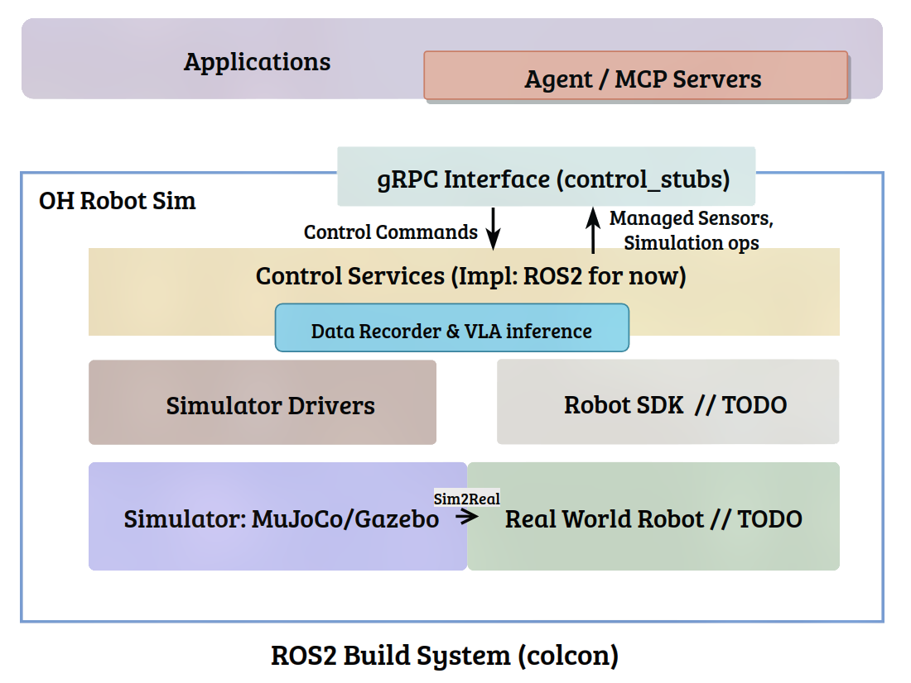

# 开发须知

## 模拟器架构

### A. 框架

### B. 数据流示意

## 项目结构

- `assets/`: 存放模拟器资源的目录，包括：

    - `models/`: 通用 Gazebo 模型（`sdf/`）、其他模型；
    
    - `maps/`: SLAM 地图；
    
    - `robots/`: 机器人描述包及对应配置（URDF，MJCF 及世界定义，ros2_control 配置，navigation2 配置等）；

    - `worlds/`: Gazebo 世界建模（`sdf/`）等；

- `common/`: 存放公共助手函数，C++ 和 Python 混合包；

- `control_stubs/`: gRPC 通用控制接口，框架向上层应用暴露的控制接口；

- `control_svc/`: 框架对于控制接口的 gRPC services 实现；

- `controllers/` (deprecated): 控制助手包；

- `demos/`: 项目示例。例如如何启动一个在 Gazebo 虚拟环境中使用 Navigation2 的小车 (`launch/gzsim.nav2.launch.py`)；

- `docker/`: 本框架使用的 Linux 宿主机的 docker 开发环境；

- `dto/`: 框架内部的数据传输类型定义；

- `oh_agent/`: 小型 Agent 框架，支持简单的工具调用和 human-in-loop，支持通过 MCP servers 向大模型暴露 `control_stubs` 中的接口（编译 `control_stubs` 后使用 `scripts/build_oh_agent_proto.sh` 生成定义）；

- `scripts/`: 一些助手脚本；

- `sim_drivers/`: 提供接入框架所需的插件包。例如将 MuJoCo 接入框架；

- `tools/`: 实用工具包集合。例如图形化的 SLAM 地图语义标注（`pgm_marker`）、数据采集（`sim_rec`）等；

## 开发规约

除了“项目结构”中介绍的各目录的用途以外，框架还对其他信息做了规约和预设。

### 1. 资源（assets）添加与修改

- 所有的 SLAM 2D 地图资源添加建议统一存放至 `assets/maps/slam2d`；

- 所有的 Gazebo world 场景添加建议统一存放至 `assets/worlds/sdf`，房间建模在该目录下的独立目录中，世界文件直接存放在该目录下即可；

- 添加机器人模型需要统一存放在 `assets/robots` 目录下，每个机器人使用独立目录，并且该目录名须为机器人名称。例如 `diffdrive_car`, `franka_panda`；

  需要注意的是，每个机器人有不同能力，例如有些支持导航（另一些则是固定位置的机器人），有些支持伺服驱动（如机械臂），有些则同时有多种能力。这里你需要创建特定的配置文件来向框架描述这个机器人：

  - 在机器人独立目录下必须创建以 `<robot_name>_desc` 为包名的包来存放 URDF 文件，建议在包的 `launch` 目录下存放启动虚拟环境并加入机器人模型的脚本，参考 `assets/robots/diffdrive_car/diffdrive_car_desc/launch`；

  - `<robot_name>_desc` 为包名的包中建议在 `config` 目录下存放 Navigation2 配置文件（因为它与机器人具体参数相关），命名方式：`nav2_params*.yaml`，<u>框架依照该文件是否存在来判断机器人是否能 SLAM 导航</u>（`is_robot_navigable`）；

  - 在机器人独立目录下可选创建以 `<robot_name>_moveit` 为包名的包，用来存放 moveit2 的系列配置文件，<u>框架依照该包是否存在来判断机器人能否被伺服驱动</u>（`is_robot_servo_capable`）。您在使用 `moveit_setup_assistant` 创建机器人 Moveit2 配置包时可以在导出时指定此包名和位置；

  - 在机器人独立目录下可选创建以 `<robot_name>_mujoco` 为包名的包，用来存放 MuJoCo 描述文件、MuJoCo 场景描述文件。<u>框架依照该包是否存在来判断机器人是否支持 MuJoCo 环境</u>（`is_robot_support_mujoco`）。

    > 注：关于 URDF 转 MJCF，您可以参考 [这个文档](./URDF2MJCF.md)，这个文档以 franka panda 为例，将 URDF 转为 MJCF，您可以对照您的模型进行修改参考。目前自动化的转换工具仍在开发当中。

  您可以在[这里](./assets/robots/README.md)看到上述关于机器人模型的简短的规约内容。

遵循以上规则可以让框架识别到对应资源，这样您可以通过 `common/src/robot_sim_common/config.py` 中定义的函数引用到您所添加的资源（使用时：`from robot_sim_common import config`）。

### 2. 接口添加与修改

对 `control_stubs` 中的 gRPC Protobuf 接口文件（`*.proto`）修改后，需要先对 `control_stubs` 包编译一遍，然后重新执行 `scripts/build_oh_agent_proto.sh` 为 OH Agent 生成控制接口。

注意不要修改 `control_stubs` 中的 `*.py / *.pyi / *.h / *.cc` 文件，它们都是中间生成文件，在下一次编译时被自动覆盖。

## 目前支持的 ROS2 中间件版本

详情请参考 `docker/` 目录下的开发环境。

注意版本匹配：[ROS2 versions](https://gazebosim.org/docs/fortress/ros_installation/)

- [x] ROS2 Humble + Gazebo Classic 跑通建图、标注、导航全流程：代号 `classic`
- [ ] ROS2 Humble + Gazebo Sim (Fortress) 跑通建图、标注、导航全流程
  - 不支持：疑似[官方地图加载问题](https://github.com/gazebosim/gz-sim/issues/2365)；
- [x] ROS2 Jazzy + Gazebo Sim (Harmonic v8.9.0，官方没有编辑地图能力) 跑通建图、标注、导航全流程：代号 `jazzy`
  - 正常使用，但 `rqt` 仅可使用压缩图像 `zstd`（未知原因）；

