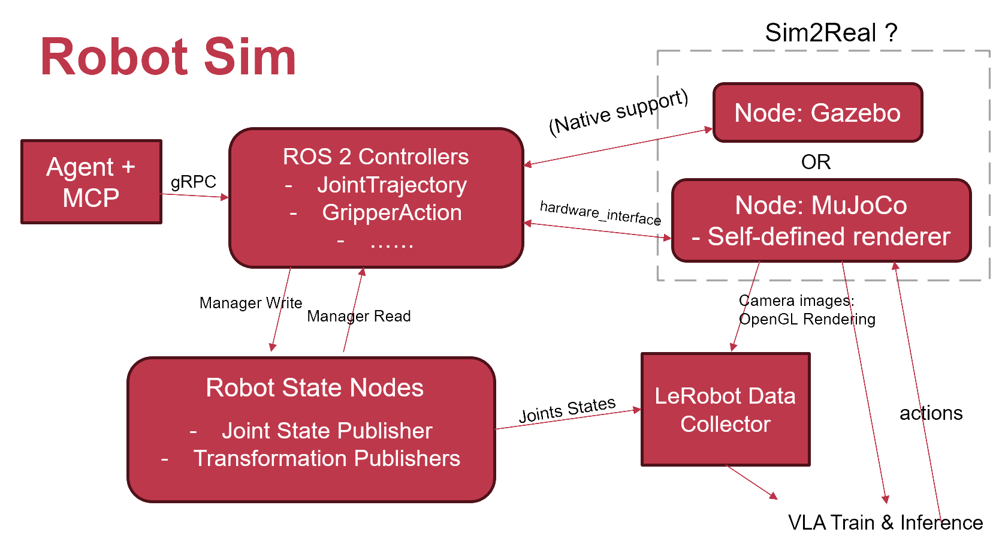

# 🏆 2026年操作系统设计赛（全国赛）— 参赛信息与完美部署教程

> [!IMPORTANT]
> **评委专家好！**
> 本项目为 **2026年全国操作系统设计赛 - OS功能挑战赛** 参赛作品。我们基于 OpenHarmony 分布式软总线与 ROS 2 仿真架构，设计并实现了一套具备高逼真物理环境与端侧协同交互的**智能病房机器人避障与药送仿真系统**。

## 👥 参赛队伍基本信息

- **选题编号**：proj15
- **项目名称**：智能病房避障与药送仿真系统
- **高校名称**：[广东石油化工学院]
- **队伍 ID**：[T2026116569911339]
- **队伍名称**：[purple_rain]

---

## 📂 核心演示与文档导航

1. **🎬 [功能演示视频（Baidu Netdisk 链接）](https://pan.baidu.com/)**
   * **提取码**：xxxx
   * *[请在此填写您的 10-30 分钟功能演示与成果讲解视频的百度网盘分享链接]*
   * 视频内详细展示了：高逼真 3D 医院场景（包含药架、30 个药品盒、8 张病床及床头屏）、雷达自主定位、高频 Nav2 导航避障与路径规划。
2. **📖 [项目核心技术架构设计说明](#-项目简介--系统架构)**
   * 本项目首创了面向 OpenHarmony (EDU) 生态的具身智能机器人模拟器框架，支持多模态语义解析、跨端分布式低延迟交互及 LeRobot 具身数据采集与训练。

---

# 🚀 完美启动与部署指南（共两种模式）

由于 OpenHarmony 端的 `hdc` 工具和虚拟机连接配置较为繁琐，我们为您提供了**两种启动模式**：
* 🌟 **方案一【极速推荐模式】（双终端，无需 QEMU，100% 马上可用）**：直接在 Docker 宿主机内跑 Nav2 导航，可立即测试机器人的定位与避障路径规划。
* 🛡️ **方案二【分布式联调模式】（宿主 Docker + QEMU 虚拟机）**：通过虚拟局域网和 hdc 连接进行双机协同，联调“PDA 与床头屏跨设备通信”分布式业务时使用。

## 🧹 第 0 步：关掉所有残留进程（环境清理）

在新开仿真前，请在您的 **PowerShell** 窗口中直接运行此命令，一键清除残留占用：

```powershell
wsl -d Ubuntu -e bash -c "sudo pkill -9 qemu 2>/dev/null; docker stop ros2-demo 2>/dev/null; echo '✅ 已清理'"
```

---

## 🌟 方案一：【极速推荐模式】纯 Docker 运行（只需 2 个终端，即刻测试导航）

此方案无需开启 OpenHarmony QEMU 虚拟机，无需安装 `hdc`。直接在 Docker 容器内拉起物理仿真、地图、导航算法与可视化窗口，非常适合用于机器人导航、避障以及算法的快速迭代。

### 📺 终端 A：拉起 Gazebo 物理仿真

1. 新开一个 **PowerShell** 窗口，输入并回车以进入 WSL：
   ```powershell
   wsl -d Ubuntu
   ```

2. 进入代码目录并进入 Docker 容器：
   ```bash
   cd /mnt/d/飞腾派/plan/2/oh_robot_sim
   ./ros-demo.sh
   ```

3. 进入 Docker 终端（看到 `root@docker-desktop:/#` 提示符）后，**复制并运行以下整段命令**：
   ```bash
   cd /root/oh_robot_sim
   source ~/.bashrc_ros 2>/dev/null
   source install/setup.bash
   export ROS_DOMAIN_ID=0
   export RMW_IMPLEMENTATION=rmw_cyclonedds_cpp
   
   # 1. 部署世界文件和地图到运行路径（确保加载最新医院病床与药架）
   cp /root/workspace/assets/worlds/sdf/hospital_ward.classic.world \
      /root/oh_robot_sim/install/asset_worlds/share/asset_worlds/sdf/
   cp /root/workspace/assets/maps/slam2d/hospital_ward.pgm \
      /root/oh_robot_sim/install/asset_maps/share/asset_maps/slam2d/
   cp /root/workspace/assets/maps/slam2d/hospital_ward.yaml \
      /root/oh_robot_sim/install/asset_maps/share/asset_maps/slam2d/
   cp /root/workspace/demos/launch/simhost.nav2.launch.py \
      /root/oh_robot_sim/install/demos/share/demos/launch/
   
   echo "✅ 医院场景文件部署成功！"
   
   # 2. 启动仿真三维世界（会自动打开一个含有病房、药架和药品盒的 Gazebo 窗口）
   export DISPLAY=:0
   ros2 launch demos simhost.nav2.launch.py
   ```

---

### 📺 终端 B：拉起 Nav2 导航算法 + RViz2 可视化界面

当终端 A 的 Gazebo 物理窗口成功弹出并完全载入后，执行本步骤：

1. **新开一个** **PowerShell** 窗口，输入并回车进入 WSL：
   ```powershell
   wsl -d Ubuntu
   ```

2. 进入正在运行 of Docker 容器：
   ```bash
   docker exec -it ros2-demo bash
   ```

3. **复制并粘贴以下整段命令**，直接在 Docker 内拉起 Nav2 导航堆和 RViz2 监控：
   ```bash
   source /opt/ros/humble/setup.bash
   source /root/oh_robot_sim/install/setup.bash
   export ROS_DOMAIN_ID=0
   export RMW_IMPLEMENTATION=rmw_cyclonedds_cpp
   export DISPLAY=:0
   
   # 1. 启动 Nav2 导航控制节点并载入医院病房地图
   ros2 launch nav2_bringup bringup_launch.py \
     map:=/root/oh_robot_sim/install/asset_maps/share/asset_maps/slam2d/hospital_ward.yaml \
     use_sim_time:=true &
   
   # 2. 等待 10 秒后启动 RViz2 导航显示监视器
   sleep 10
   rviz2 -d /opt/ros/humble/share/nav2_bringup/rviz/nav2_default_view.rviz &
   ```

> 🎉 **测试成功标志**：RViz2 窗口弹出，展示医院二维激光栅格地图。您可以在 RViz2 顶部点击 **"2D Pose Estimate"** 标定机器人的初始位置，然后点击 **"Nav2 Goal"** 给机器人发送导航目的地，观察机器人在三维 Gazebo 中平稳避障驶向目标点！

---

## 🛡️ 方案二：【分布式联调模式】宿主 Docker + QEMU 虚拟机（后续调试软总线时使用）

当您在 Windows 上安装好 OpenHarmony SDK 拥有 `hdc` 工具后，或者需要联调 **“PDA 与床头屏跨设备通信”** 等分布式场景时，使用本方案。

### 📺 终端 1：启动 QEMU 模拟器 (OpenHarmony)
1. 新开 **PowerShell** -> `wsl -d Ubuntu`
2. 运行：
   ```bash
   cd /mnt/d/飞腾派/plan/2/ohedu-robosim-nav2demo
   sudo service libvirtd start
   sudo virsh net-start default 2>/dev/null
   sudo ./qemu_run_client.sh
   ```
   *等待 QEMU 窗口完全出现（OH 虚拟机 IP 通常为 `192.168.122.111`）。*

### 🐳 终端 2：启动 Docker 宿主仿真后端
1. 新开 **PowerShell** -> `wsl -d Ubuntu` -> 进入目录进入 Docker 容器：
   ```bash
   cd /mnt/d/飞腾派/plan/2/oh_robot_sim && ./ros-demo.sh
   ```
2. 在 Docker 中粘贴并运行以下配置通信并启动仿真：
   ```bash
   cd /root/oh_robot_sim
   source ~/.bashrc_ros 2>/dev/null
   source install/setup.bash
   export ROS_DOMAIN_ID=0
   export RMW_IMPLEMENTATION=rmw_cyclonedds_cpp
   
   # 配置 CycloneDDS 多机联调地址
   cat > /root/cyclonedds.xml << 'EOF'
   <?xml version="1.0" encoding="UTF-8" ?>
   <CycloneDDS xmlns="https://cdds.io/config">
     <Domain id="any">
       <Discovery>
         <Peers><Peer address="192.168.122.111"/></Peers>
       </Discovery>
     </Domain>
   </CycloneDDS>
   EOF
   export CYCLONEDDS_URI=file:///root/cyclonedds.xml
   
   # 部署场景文件
   cp /root/workspace/assets/worlds/sdf/hospital_ward.classic.world /root/oh_robot_sim/install/asset_worlds/share/asset_worlds/sdf/
   cp /root/workspace/assets/maps/slam2d/hospital_ward.pgm /root/oh_robot_sim/install/asset_maps/share/asset_maps/slam2d/
   cp /root/workspace/assets/maps/slam2d/hospital_ward.yaml /root/oh_robot_sim/install/asset_maps/share/asset_maps/slam2d/
   cp /root/workspace/demos/launch/simhost.nav2.launch.py /root/oh_robot_sim/install/demos/share/demos/launch/
   
   # 启动
   export DISPLAY=:0
   ros2 launch demos simhost.nav2.launch.py
   ```

### 📱 终端 3：HDC 连接并启动 OpenHarmony 导航端
*(注意：需要确保您的运行环境已成功安装 hdc 工具)*
1. 新开 **PowerShell** -> `wsl -d Ubuntu`
2. 运行 hdc 连接：
   ```bash
   cd /mnt/d/飞腾派/plan/2/ohedu-robosim-nav2demo
   hdc tconn 192.168.122.111:55555
   hdc shell
   ```
3. 在连接成功的 QEMU Shell 终端中运行：
   ```bash
   cd /data/
   source ros2ohos.env
   set +e
   cd ors
   source install/setup.sh
   export ROS_DOMAIN_ID=0
   ros2 launch demos simoh.nav2.launch.py map:=hospital_ward.yaml
   ```

---

# 🏗️ 项目简介 & 系统架构

## 📋 项目简介

Robot Sim 是首个面向 OpenHarmony (EDU) 生态的具身智能机器人模拟器框架，支持自然语言交互、端侧伺服遥控、物理仿真、数据采集及 VLA 模型管理。

核心定位：为 OpenHarmony 开发者提供低成本、高效率的具身智能研发工具，解决现有仿真生态与 OpenHarmony 割裂、端侧协同不足、模型迭代困难等问题。

## ✨ 核心特性

### 1. OpenHarmony 原生适配

*   整合 ROS2 Controllers、Robot State Nodes 等核心组件至 OpenHarmony OS
*   支持 OpenHarmony 端侧设备无缝接入仿真系统
*   基于 OpenHarmony 分布式软总线实现跨设备低延迟通信

### 2. 端侧伺服遥控

*   端侧设备化身「伺服遥控器」，通过触摸、姿态等自然交互操纵仿真机器人
*   LeRobot 数据采集，同步获取相机图像、关节状态等多源数据

### 3. 多模态具身任务支持

*   「自然语言 + Agent + MCP」语义解析链路，实现高层指令快速转化
*   兼容 Gazebo/MuJoCo 双仿真引擎，模拟真实物理环境

### 4. 全流程模型支持

*   对接 LeRobot 训练框架，支持 ACT/pi0 等 VLA 模型训练
*   提供模型推理部署接口，快速验证仿真到真实场景迁移效果

## 🏗️ 系统架构



| 层级 | 核心模块 | 功能说明 |
| --- | --- | --- |
| 交互层 | ArkTS 前端、端侧伺服遥控、Agent+MCP | 多模态指令输入、可视化交互、端侧协同控制 |
| 控制层 | ROS2 Controllers、Robot State Nodes | 关节轨迹规划、状态采集发布、控制信号生成 |
| 仿真层 | Gazebo/MuJoCo 仿真节点 | 物理仿真、机器人模型驱动、图像渲染 |
| 数据与模型层 | LeRobot Data Collector、VLA Train\&Inference | 多源数据采集、模型训练、推理部署 |

## 🛠️ 技术栈

| 领域 | 核心技术 / 工具 |
| --- | --- |
| 操作系统 | OpenHarmony 5.1.0, Ubuntu 22.04 |
| 机器人控制 | ROS2 |
| 前端开发 | ArkTS |
| 仿真引擎 | Gazebo、MuJoCo |
| Model 训练 | PyTorch、LeRobot |
| 通信协议 | gRPC、ROS2 DDS、HTTP |

---

## 📄 许可证

本项目基于 Apache License 2.0 开源，详见 [LICENSE](LICENSE) 文件。

## 🙏 致谢

感谢 OpenHarmony 社区提供的技术支持与生态保障。
